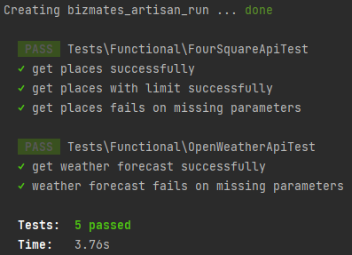
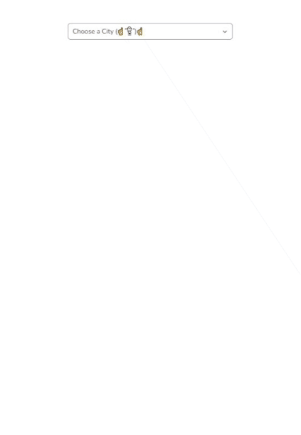

<!-- ABOUT THE PROJECT  -->
##### Time spent: 5 hours
# About The Project

Simple and easy-to-use weather app that display's weather information and places to hang out in.
Approached with mobile-first design in mind.

API integration and UI clearly exhibits the following:

* Clear separation of concerns by keeping services and controller logic handling separate.
* Interfaces are maintained to keep services open to extension, closed to modification.
* Fair use of DTO's to avoid breaking L in SOLID.
* Built with Docker and Vite for ease of development and deployment.
* Baseline error handling for both API and FE.
* Typescript, coz strict-typing is awesome.
* With some cool personalizations here and there. 😅

- Built With
- [x] Laravel
- [x] Vue
- [x] Vite
- [x] Typescript
- [x] Tailwind
- [x] Docker

## Project Setup

#### Copy and rename ./.env.example to ./.env.

* set value for `OPEN_WEATHER_KEY=<open_weather_api_key>`
* set value for `FOURSQUARE_KEY=<four_square_api_key>`

````
% docker-compose up --build
% docker-compose run --rm composer install
% docker-compose run --rm npm install
% docker-compose run --rm --service-ports npm run dev
````

###### Artisan has been dockerized to easily access run `artisan` commands from the terminal. Since we're dealing with external API's functional tests are implemented as hitting the actual external API is important. API integration considers mocking or stubbing so its extensible to do so if required.
```
% docker-compose run --rm artisan test
```


Sample screenies 🎉

Desktop 🖥️


Mobile 🤳

